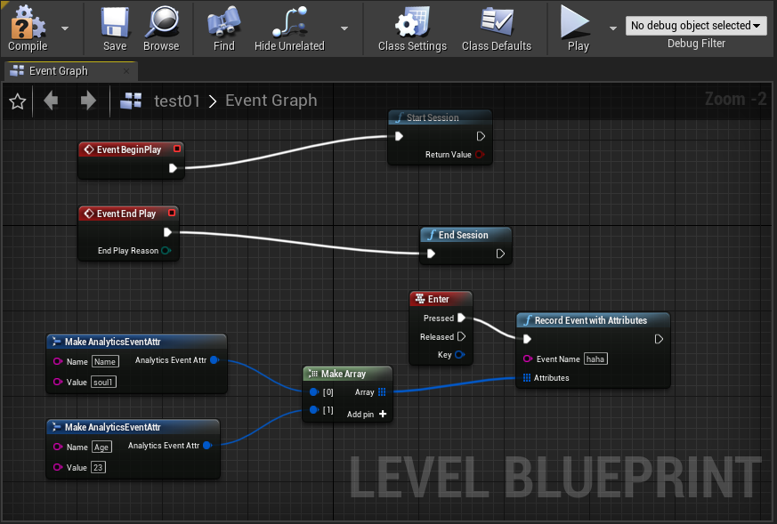

# SoulBound Analytics Plugin for Unreal Engine 4

This plugin behaves as an Analytics Provider for Unreal Engine 4.

## Requirements

- Unreal Engine 4.26
- Get SoulBound API Key at (https://mainframe.soulbound.gg) (Create a user followed by a game and get the api key for staging or production environment)

## Getting Started

The following document assumes that the current Unreal Engine have been compiled from sources or it have all dependencies so third party plugins can be build.

### Download and place the plugin

Get a copy of the plugin from the (https://mainframe.soulbound.gg):

Assuming the UE 4 code is downloaded, 
Switch to UE-4.26 branch:


Copy the soulbound sdk to your Engine plugins folder, the target path looks like:

```
UnrealEngine/Engine/Plugins/soulbound-ue-sdk
```

> Alternative you can copy the plugin content inside your Project Plugin directory and unzip it. 

Now that plugin code is there, build the visual studio (or any other environment)

### Enable the Analytics plugins for your project

Inside the Unreal Engine 4 Editor, open your project and the _plugins_ window:

- Edit > Plugins

Now enable the two required plugins:

- Blueprints: located at Built-in > Analytics 
- SoulBound: located at Installed > Analytics 

### Configure Project settings

From your project directory, open and edit the file Config/DefaultEngine.ini and append the following content at bottom:

```
[Analytics]
ProviderModuleName=SoulBound
TDApiKey="TD-WRITE-ONLY-KEY"
TDRegion=[US02]
SendInterval=10

[AnalyticsDevelopment]
ProviderModuleName=SoulBound
TDApiKey="TD-WRITE-ONLY-KEY"
TDRegion=[US02]
SendInterval=10

[AnalyticsTest]
ProviderModuleName=SoulBound
TDApiKey="TD-WRITE-ONLY-KEY"
TDRegion=[US02]
SendInterval=10
```

Save the file and restart Unreal Engine Editor.
### Gather metrics through C++ code
Following code section explains how to use the sdk using code. The UserID shoud be set before beginning the session so that all events have the identity attached.

Include analytics modules where events need to be recorded.

```
#include "Runtime/Analytics/Analytics/Public/Analytics.h"
#include "Runtime/Analytics/Analytics/Public/Interfaces/IAnalyticsProvider.h"
```
Events are how users interact with your game. "Game Started" may be an action you want to record.

```
FAnalytics::Get().GetDefaultConfiguredProvider()->SetUserID(TEXT("test123@test.com"));
FAnalytics::Get().GetDefaultConfiguredProvider()->StartSession();
FAnalytics::Get().GetDefaultConfiguredProvider()->RecordEvent(TEXT("Game started"));
```
Events can contain properties. Properties give more information about the event taken.
```
TArray<FAnalyticsEventAttribute> AppendedAttributes;
AppendedAttributes.Emplace(TEXT("Test Event Prop key1"), TEXT("Test Event value1"));
AppendedAttributes.Emplace(TEXT("Test Event Prop key2"), TEXT("Test Event value2"));
FAnalytics::Get().GetDefaultConfiguredProvider()->RecordEvent(TEXT("Game Started"), AppendedAttributes);

FAnalytics::Get().GetDefaultConfiguredProvider()->SetLocation(TEXT("Test location"));
FAnalytics::Get().GetDefaultConfiguredProvider()->SetGender(TEXT("Test gender"));
	
FAnalytics::Get().GetDefaultConfiguredProvider()->EndSession();
```


### Gather metrics through Blueprints

In the Editor, click on the Blueprints dropdown menu and click on the _Open Level Blueprint_ option:

Now in the Event graphs, different events can be connected to Analytics functions, as an example the following image demonstrate how to track the _Session Start_, _Session End_ and _Record Event w/Attributes_ events:



After a Game starts, the plugin will send the events to SoulBound.

